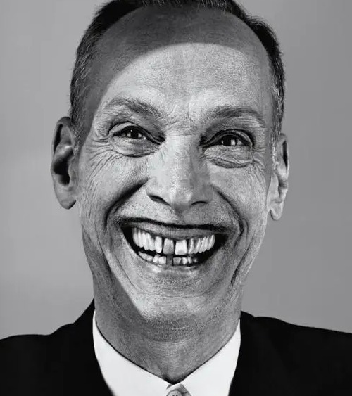
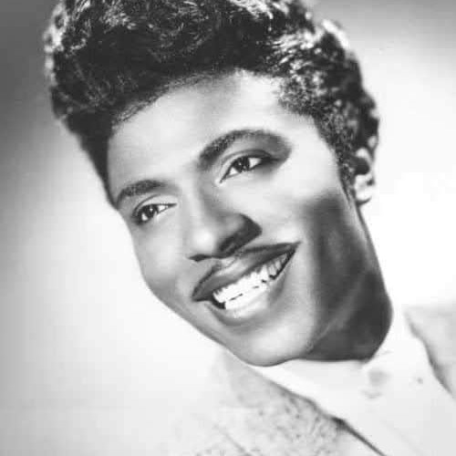
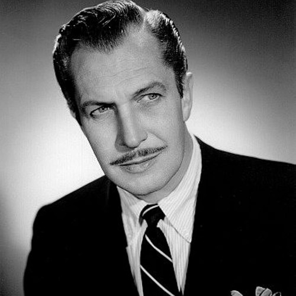
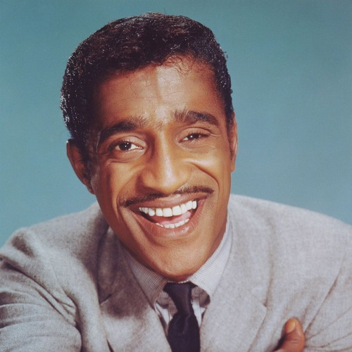

---
# You don't need to edit this file, it's empty on purpose.
# Edit theme's home layout instead if you wanna make some changes
# See: https://jekyllrb.com/docs/themes/#overriding-theme-defaults
layout: default
---

<article class="works">
    <h1>Pencil Moustache Hall of Fame</h1>
    

        Welcome to the Pencil Moustache Hall of Fame! This distinguished establishment celebrates the iconic and timeless style of the pencil moustache. From Hollywood celebrities to historical figures, the pencil moustache has graced the upper lips of some of the most famous and influential people in the world. Its thin, precise and groomed appearance has become synonymous with sophistication, elegance, and a touch of mystery. In this hall of fame, we pay tribute to the men who have sported the pencil moustache with class and style, leaving a lasting impression on the world of fashion and culture. Join us as we honor the pencil moustache and the men who have made it famous.
    

    

        
        John Waters is known for his distinctive pencil-thin mustache, which has become a hallmark of his personal style. The mustache is groomed to be narrow and straight, extending just beyond the corners of his mouth. It is typically black in color, and stands out against his fair skin. Waters has been known to dye his mustache to maintain its dark color, and he has stated that he considers it to be an important part of his public persona. Overall, John Waters' mustache is a defining feature of his unique look, and has become an iconic symbol of his subversive style and irreverent sense of humor.
    

    

        
        The late Little Richard, also known as "The Architect of Rock and Roll," was known for his flamboyant and energetic performances, as well as his distinctive personal style, which included a pencil mustache. The mustache was thin and closely trimmed, with sharply defined edges that extended just beyond the corners of his mouth. It was typically styled to be straight and narrow, emphasizing its sharp and precise appearance. The pencil mustache was often paired with a close-cropped beard or goatee, which helped to balance out the overall look. Little Richard's pencil mustache was a signature part of his larger-than-life persona, and it helped to establish him as a true rock and roll icon.
    

    

        
        Vincent Price was an American actor known for his distinctive voice and his roles in horror films. He was also known for his distinguished and sophisticated style, which included a well-groomed mustache. Price's mustache was thick and full, but not overly bushy. It was typically styled to be straight and neatly trimmed, with sharply defined edges that extended just beyond the corners of his mouth. The mustache was usually a shade darker than his hair, which was often silver or gray in his later years. Price's mustache was a defining feature of his elegant and refined appearance, and it added to his overall aura of sophistication and intellect. It remains an iconic part of his legacy and personal style.
    

    

        
        Sammy Davis Jr. was a legendary performer and member of the Rat Pack, known for his smooth vocals and flashy style. His mustache was an important part of his look, and it was typically styled to be thin and neatly trimmed. The mustache was closely groomed and typically black in color, matching his hair, which he often wore in a short, slicked-back style. The edges of the mustache were sharply defined and extended just beyond the corners of his mouth, emphasizing the shape of his face and his distinctive smile. Overall, Sammy Davis Jr.'s mustache was an integral part of his sleek and stylish appearance, and it helped to add to his overall sense of charisma and cool.
    

</article>